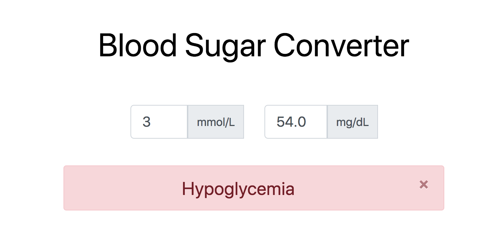

# Blood glucose converter app

## The app converts from mmol/L to mg/dL and vice versa!

This repo is a starting point of this application. The idea is to convert this plain react app (with local state) to redux state management.

Stay tuned!

### Demo:

